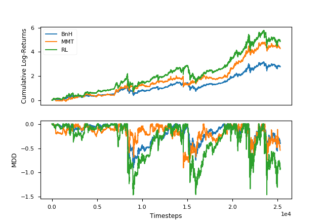

# Trading Bitcoin with Reinforcement Learning

This [post](https://launchpad.ai/blog/trading-bitcoin) describes how to apply reinforcement learning algorithm to trade Bitcoin. This repository provides an implementation aims to reproduce the result.

<p align="center">

- **BnH**

  A *buy-and-hold* strategy that always hold 2 Bitcoins starting from the beginning of the test period.

- **RL**

  A trained RL agent making trading decisions to hold 0~4 Bitcoins given the current market condition.

- **MMT**

  A *momentum* strategy that holds 4 Bitcoins when the 30-period SMA cross-over than the current closing price and 0 Bitcoin otherwise.


Dependencies

- Python3.6
- NumPy 1.17.1
- Pandas 0.25.1
- Matplotlib 3.1.1
- PyTorch 1.2.0 (CPU only)


## Data

The minute-by-minute data is downloaded from [Kaggle](https://www.kaggle.com/mczielinski/bitcoin-historical-data/data). I resample them into 15-minute interval and compute all the features we need. Then I save the two dataframes under `bitcoin-historical-data`.


Note that,

- I delete the row indexed `2017-04-15 23:00:00` after resampling since there is a clear error. This is done in the `remove_outlier()` method under the `Data` class.

- Due to request, I include the 15-minute data in `bitcoin-historical-data` (due to size constraint on GitHub, I cannot update the 1-minute data and the feature dataframe generated from the 15-minute data.)


## How to run

```bash
# E.g. clone to local (say to Downloads)
cd ~/Downloads/trading-bitcoin-with-reinforcement-learning/

# Usage: python main.py <path-to-one-minute-data>
# If argument not provided, the default file path
# './bitcoin-historical-data/coinbaseUSD_1-min_data.csv' is given
python main.py ./bitcoin-historical-data/coinbaseUSD_1-min_data.csv
```


***Note: I observed substantial variability in the test result therefore the equity curve you got may not be 100% the same as mine.***